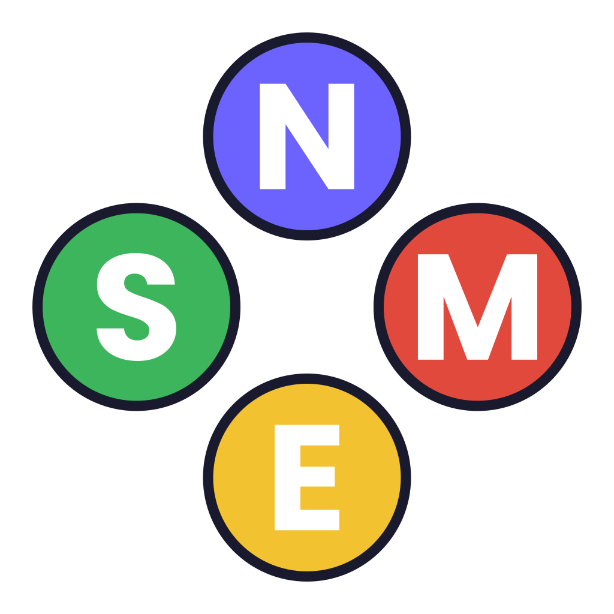
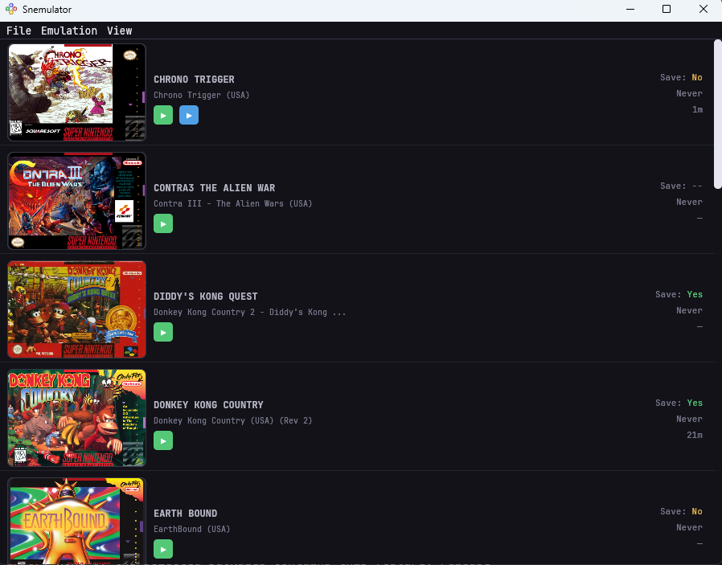
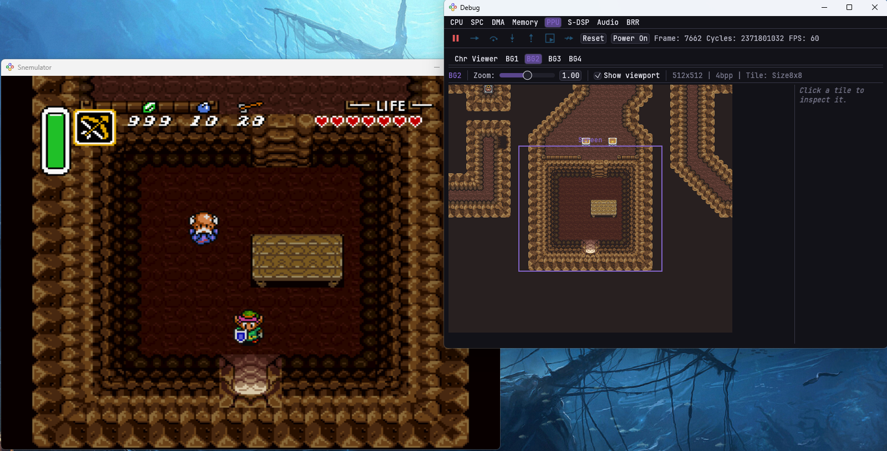

<p align="center">
  
</p>

# Snemulator: Super Nintendo emulator written in Rust

## Features

- (Mostly) Cycle-accurate emulation
- Debug viewer including:
    - CPU trace (breakpoints!)
    - Graphics data visualizations (tilemaps, character data)
    - Complete memory dumps
    - Sound data visualizations
- Save states
- Controller remapping

## Screenshots

| | |
|---|---|
|  |  |


## Releases

Pre-built binaries are available on the [Releases](../../releases) page. Download the zip file for your platform:

- **Windows** — `snemulator-windows.zip`
- **Linux** — `snemulator-linux.zip`
- **macOS (Intel/x86)** — `snemulator-macos-x86_64.zip`
- **macOS (Apple Silicon/ARM)** — `snemulator-macos-arm64.zip`

Unzip the archive and run the executable inside.

> **Note for macOS users:** Since the app isn't notarized/signed, macOS will block it from running by default. To allow it:
> 1. Try to open the app (it will be blocked).
> 2. Go to **System Settings → Privacy & Security**, scroll down, and click **Open Anyway** next to the warning about Snemulator.
> 3. Confirm by clicking **Open Anyway** on the follow-up prompt.

ROM files are not included. You'll need to source those on your own.

## Build From Source

To build and run the app from source, the `cargo` tool is required:

```
cargo run --bin snemulator
```

To compile with debug features enabled (super cool for looking at game internals), run:

```
cargo run --bin snemulator --features=debug
```

For an optimized build, add the `--release` flag:

```
cargo run --bin snemulator --release
```

Run with `--help` to see all available command-line argument options:

```
cargo run --bin snemulator -- --help
```

## Disclaimer

- Games that rely on most coprocessors (e.g. Super FX, SA-1, etc.) are not supported — don't be surprised if a particular game won't load.
- This emulator isn't going to match the performance, accuracy, or game compatibility of established emulators like [bsnes](https://github.com/bsnes-emu/bsnes) or [snes9x](https://github.com/snes9xgit/snes9x).
- If you need reliable, serious emulation, use one of those instead. We're proud of what we built here, but it's a passion project, not a competitor to the best solutions out there.

## Contributing

As of right now, we have no concrete plans to implement the other coprocessors. This was our second big Rust project.
It turned out better than our first, but there's plenty of room for improvement. If you have suggestions or ideas on
how new features could be implemented or old features could be improved, feel free to submit a pull request! Always
looking to learn better techniques.

## License

Snemulator is licensed under the [GNU General Public License v3.0](LICENSE) (GPLv3).
 
Our DSP-1 coprocessor implementation is a translation of the corresponding implementation from [bsnes](https://github.com/bsnes-emu/bsnes), which is also GPLv3-licensed. Since that portion of our code is a derivative work, the project as a whole is licensed under GPLv3 to comply with those terms.
 
In short, this means:
- You're free to use, modify, and distribute Snemulator.
- Any distributed version (including modified forks) must also be licensed under GPLv3, with source code made available.
See the [LICENSE](LICENSE) file for the full license text.

## Acknowledgements

A huuuuge thanks to the SnesDev community! This project wouldn't have been possible without the hard work of the community members and the guiding lights of NoCash, Anomie, Blargg, byuu/Near, and more.